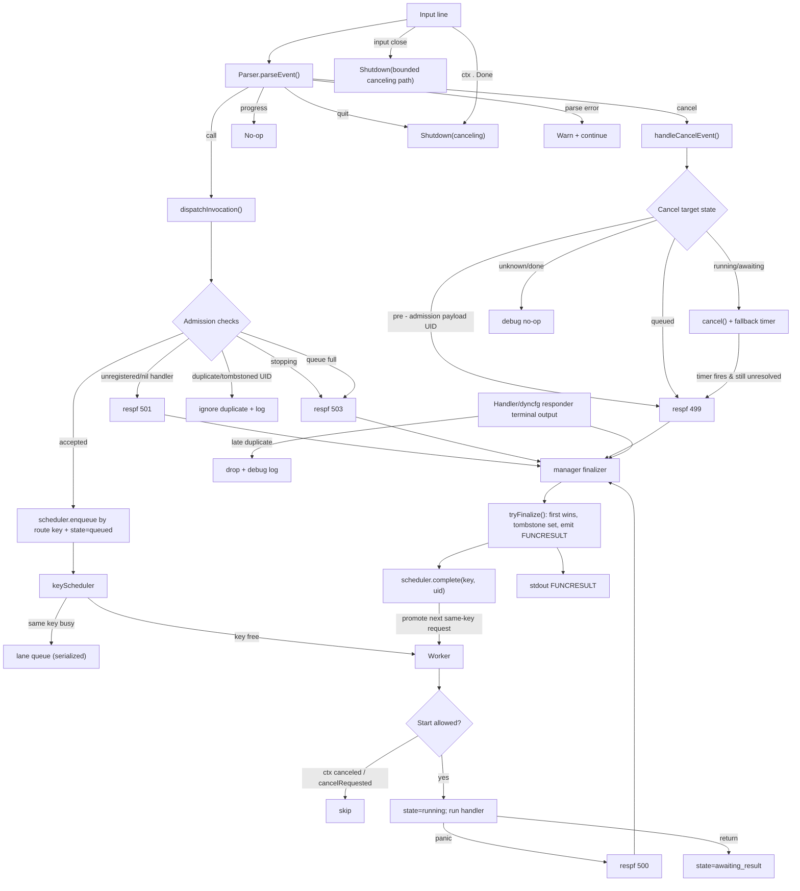

# framework/functions manager

This document describes how the functions manager works **today** (current implementation).

## Scope

- Package: `src/go/plugin/framework/functions`
- Main implementation:
    - `manager.go`
    - `manager_worker.go`
    - `scheduler.go`
    - `parser.go`
    - `finalizer.go`

## Input protocol handled by parser

The parser recognizes these line types:

- `FUNCTION ...`
- `FUNCTION_PAYLOAD ...` + payload body + `FUNCTION_PAYLOAD_END`
- `FUNCTION_CANCEL <transaction_id>`
- `FUNCTION_PROGRESS ...` (recognized/no-op event for manager)
- `QUIT`

Payload-mode control behavior:

- `FUNCTION_CANCEL <same payload uid>`:
    - abort payload frame
    - emit pre-admission cancel event
- `FUNCTION_CANCEL <different uid>`:
    - emit cancel event
    - continue payload accumulation
- `FUNCTION_PROGRESS ...`:
    - emit progress event
    - continue payload accumulation
- `QUIT`:
    - abort payload frame
    - emit quit event
- Any other `FUNCTION*` control line:
    - abort current payload frame
    - never dispatch partial payload

## Runtime architecture

### Dispatcher

The dispatcher loop:

- reads input lines
- parses events
- handles cancel/quit/progress
- resolves handler + route-aware schedule key
- admits calls into keyed scheduler

Admission checks:

- manager stopping -> reject `503`
- unknown/nil handler -> reject `501`
- duplicate active/tombstoned UID -> ignore duplicate input (debug/warn log, no terminal output)
- queue full -> reject `503`

### Keyed scheduler + worker pool

- fixed-size worker pool (`defaultWorkerCount = 1`)
- bounded pending budget (`defaultQueueSize = 64`)
- per-key serialization:
    - same schedule key executes sequentially
    - different schedule keys execute concurrently (up to worker count)
- schedule key is route-aware:
    - direct registration: `fn.Name`
    - prefix registration: `fn.Name|<matched-prefix>`
- prefix registration guard:
    - overlapped prefixes for the same function name are rejected at registration time
    - manager logs an error and keeps the previously registered prefix set unchanged
- worker transitions lifecycle:
    - `queued -> running -> awaiting_result`
- worker return is **not** terminal completion
- panic path finalizes terminal `500`

### Tracking and finalization

Active requests are tracked by UID:

- `invState` map (active entries)
- tombstones (`defaultTombstoneTTL = 60s`) to block immediate UID reuse

All terminal outputs go through:

- manager-bound terminal finalizer (`m.finalizeTerminal`)
- dyncfg responders receive manager finalizer wiring at component construction time

`tryFinalize` guarantees:

- first terminal writer wins
- late terminal duplicates are dropped
- fallback timer is stopped on finalization
- awaiting-result warning timer is stopped on finalization
- UID becomes tombstoned for a short window

Awaiting-result observability:

- when a worker returns without terminal output, manager moves UID to `awaiting_result`
- manager starts a warning timer (`defaultAwaitingWarnDelay = 30s`, capped by function timeout if lower)
- timer emits a warning log if UID is still `awaiting_result` (diagnostic only, no forced finalize)

## Runtime metrics

Functions manager owns an internal runtime store (`metrix.NewRuntimeStore()`), and
can register it as a runtime component when runtime service is injected via
`SetRuntimeService(...)`.

Registered component metadata:

- component name: `functions.manager`
- module: `functions`
- job: `manager`
- autogen charts: enabled

Pathology-focused metrics currently exposed:

- gauges:
    - `netdata.go.plugin.framework.functions.manager.invocations_active`
    - `netdata.go.plugin.framework.functions.manager.invocations_awaiting_result`
    - `netdata.go.plugin.framework.functions.manager.scheduler_pending`
- counters:
    - `netdata.go.plugin.framework.functions.manager.queue_full_total`
    - `netdata.go.plugin.framework.functions.manager.cancel_fallback_total`
    - `netdata.go.plugin.framework.functions.manager.late_terminal_dropped_total`
    - `netdata.go.plugin.framework.functions.manager.duplicate_uid_ignored_total`

## Cancellation semantics

### 1) Queued request

- mark cancel requested
- cancel internal context
- finalize exactly once with `499`
- worker skips execution if it dequeues a canceled request

### 2) Running / awaiting_result request

- mark cancel requested
- call internal cancel func
- start fallback timer (`defaultCancelFallbackDelay = 5s`)
- if no terminal output arrives before timer, manager finalizes with `499`

Important limitation:

- handlers are currently `func(Function)` (no `context.Context` parameter)
- manager cannot force-stop handler code directly
- fallback `499` is the deterministic safety net

### 3) Unknown / already completed request

- no-op
- debug log only

## Shutdown behavior

Shutdown uses one bounded path for `ctx.Done()`, `QUIT`, and input close (EOF):

- set stopping
- stop scheduler admission
- wait up to `defaultShutdownDrainTimeout = 8s` for natural drain
- if drain times out **or** unresolved active UIDs remain after worker drain:
    - cancel in-flight
    - force-finalize unresolved UIDs with `499`
    - hard-stop scheduler waiters

Input close still enters the same bounded path above:

- input close/EOF:
    - stop scheduler admission
    - attempt bounded drain first
    - escalate to cancel/force-finalize on timeout or if active UIDs remain unresolved

## Flow diagram

